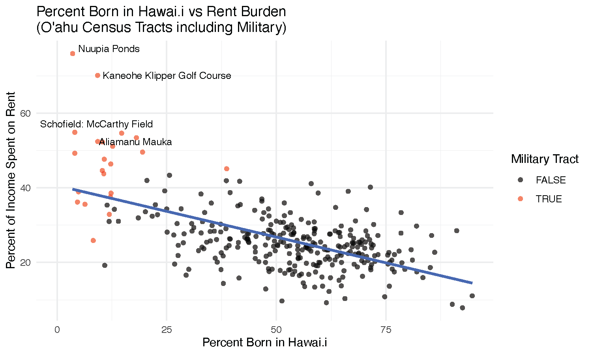
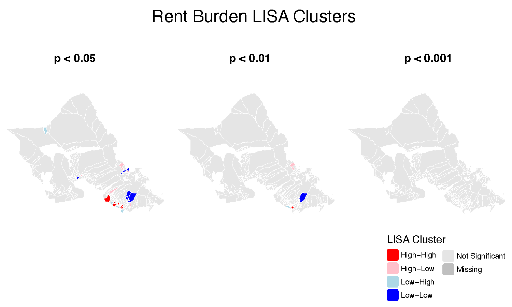
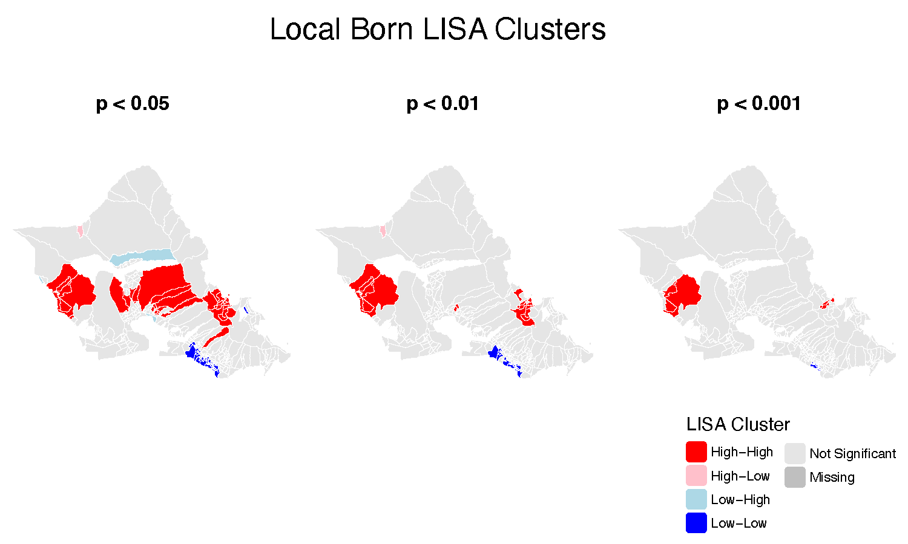
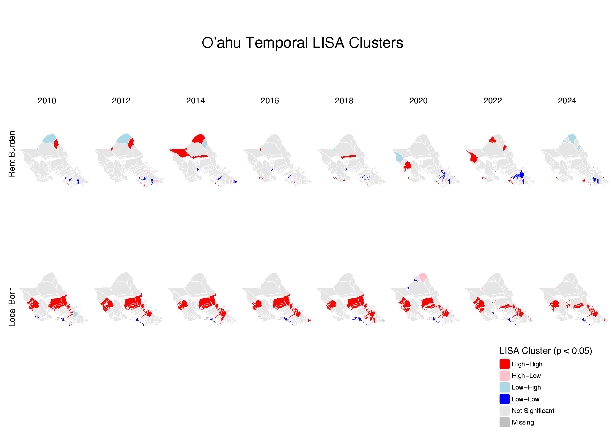
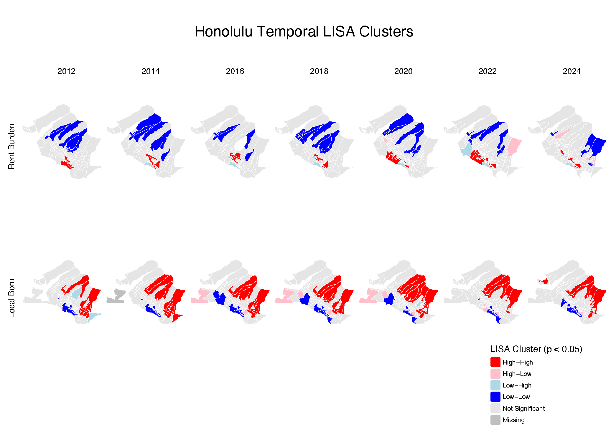

# Spatial Analysis of Rent Burden and Demographic Change on Oʻahu

Cole Yanagihara  
University of Illinois Urbana-Champaign  
UP 317: Introduction to Urban Data Science  
Professor Irene Farah  
May 2026

## Overview

This project examines spatial patterns of housing affordability pressure and demographic change across Oʻahu, Hawaiʻi from 2010–2024.

Using American Community Survey (ACS) data, exploratory spatial analysis, and Local Indicators of Spatial Association (LISA), this project investigates whether patterns of rent burden and Hawaiʻi-born population concentration align with expected indicators of gentrification.

Due to Hawaiʻi's unique housing market, constrained geography, and demographic context, this analysis explores whether traditional gentrification frameworks developed in mainland U.S. cities accurately describe neighborhood change on Oʻahu.

## Research Question

**How are rent burden and Hawaiʻi-born population clusters distributed throughout Oʻahu, and do these patterns align with expected signs of gentrification?**

## Methods

- ACS 5-Year Estimates (2010–2024)
- Census tract-level spatial analysis
- Data processing using `sf` and `tidycensus`
- Exploratory analysis using `ggplot2`
- Spatial autocorrelation analysis using `spdep`
- Local Moran's I (LISA) cluster analysis
- Map design and refinement using Adobe Illustrator

## Data Processing

Several preprocessing steps were performed to improve the reliability of spatial analysis:

- Removed Northwestern Hawaiian Islands from the study area
- Excluded military-associated census tracts due to distinct housing conditions and extreme rent burden values
- Calculated:
  - **Rent Burden:** Annualized median rent divided by median household income
  - **Local Born Percentage:** Hawaiʻi-born population divided by total population

Final dataset:
- 328 census tracts across Oʻahu

## Exploratory Analysis

### Relationship Between Rent Burden and Hawaiʻi-Born Population

Military-associated census tracts substantially influenced initial correlations between rent burden and local-born population. After removing these tracts, the relationship became substantially weaker.

## Spatial Analysis

### Rent Burden Spatial Clustering

Rent burden demonstrated statistically significant but relatively weak spatial clustering.

Global Moran's I:

- Moran's I = 0.165
- z-score = 4.89
- p < 0.001

### Hawaiʻi-Born Population Spatial Clustering

Hawaiʻi-born population patterns demonstrated much stronger spatial clustering.

Global Moran's I:

- Moran's I = 0.548
- z-score = 16.29
- p < 0.001

## Temporal Spatial Analysis

To examine how neighborhood patterns changed over time, temporal Local Moran's I analyses were conducted from 2010–2024 using consistent k = 5 nearest neighbor spatial weights.

### Rent Burden Change Over Time

Rent burden clusters demonstrated variability across the study period. While some high–high clusters persisted in urban Honolulu, overall rent burden patterns were less stable, suggesting that median rent alone may not fully capture long-term displacement pressure.

### Hawaiʻi-Born Population Change Over Time

Temporal LISA analysis revealed stronger and more persistent demographic clustering. High–high Hawaiʻi-born clusters remained concentrated in windward and leeward communities, while low–low clusters persisted in central Honolulu.

Although some localized demographic shifts were observed in areas such as Kāhala and Kaimukī, these changes did not consistently correspond with increasing rent burden.

## Key Findings

- Rent burden showed statistically significant but weak spatial clustering across Oʻahu.
- Hawaiʻi-born population patterns showed stronger and more persistent spatial clustering.
- Areas with high proportions of Hawaiʻi-born residents did not consistently overlap with high rent burden areas.
- Overall, this analysis found limited evidence of classic gentrification patterns on Oʻahu.

## Conclusion

While localized demographic shifts were observed in areas such as Kāhala and Kaimukī, these changes did not consistently correspond with increasing rent burden. The results suggest that conventional gentrification frameworks may not fully capture neighborhood change in Hawaiʻi due to unique factors including constrained geography, military presence, multigenerational homeownership, and culturally significant communities.

## Future Improvements

Future analysis could incorporate additional housing datasets, property transaction data, and predictive modeling approaches to better estimate neighborhood change and displacement risk beyond ACS-based indicators.
